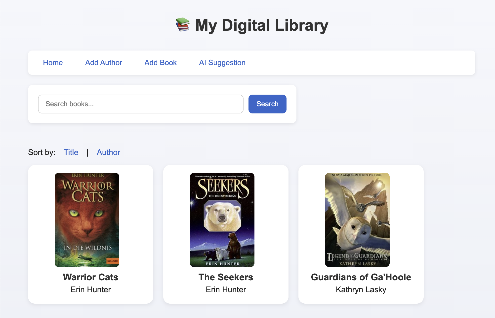
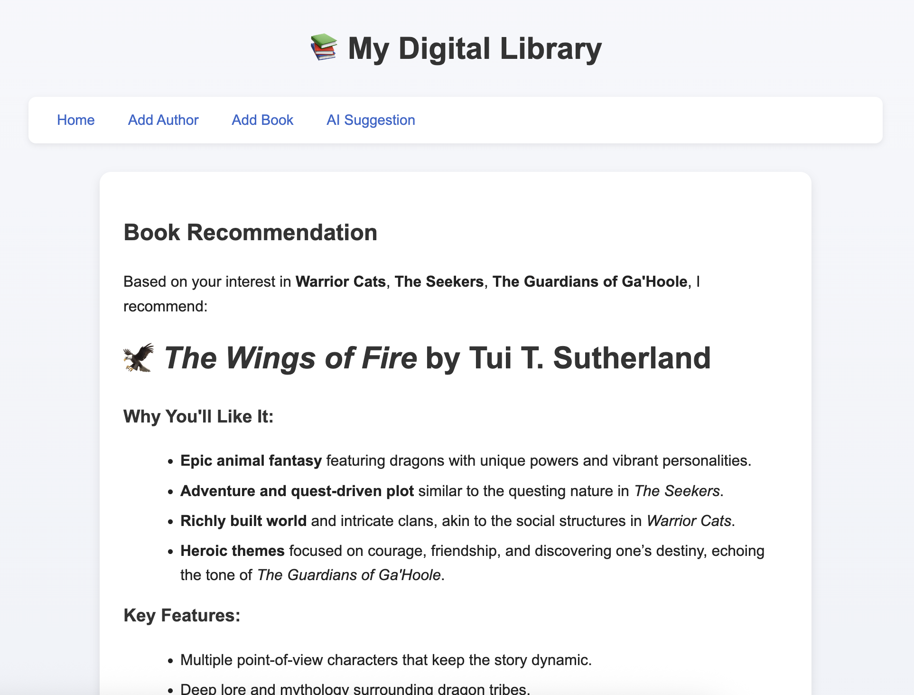

# BookAlchemy - Digital Library Application

This project is a simple digital library built with **Flask** and
**Flask-SQLAlchemy**.\
Users can add authors, add books with covers, rate books, delete entries, search, sort, and get AI-powered book recommendations.



------------------------------------------------------------------------

## ✨ Features

### ✅ Core functionality  
- Add authors (with birth & death dates)  
- Add books (title, ISBN, year, rating, cover via OpenLibrary)  
- Search books by title  
- Sort by title or author  
- View detailed book pages  
- Delete a book or delete an author with all of their books  
- Fully styled UI with responsive book cards  

### 🤖 Bonus: AI Suggestion  
Get a smart book recommendation based on all books currently in your library.  
Uses Markdown → rendered beautifully in HTML.

---

## 🖼 AI suggestion example:  


---

## 🚀 Running the App

### 1. Install dependencies
```bash
pip install -r requirements.txt
```

### 2. Create the database folder
```bash
mkdir -p data
```

### 3. Set your OpenAI key in `.env`:

```
OPENAI_API_KEY=your_key_here
```


### 4. Run the application
```bash
python app.py
```

### 5. Open in browser
```
http://127.0.0.1:5000
```

---

## 🔧 Tech Stack
- Python 3  
- Flask  
- Flask-SQLAlchemy  
- OpenLibrary Cover API  
- OpenAI GPT 

---

## 📁 Project Structure
```
    project/
    │── app.py
    │── data_models.py
    │── data/
    │   └── library.sqlite
    │── static/
    │   └── styles.css
    │── templates/
    │   ├── home.html
    │   ├── add_author.html
    │   ├── add_book.html
    │   ├── book_detail.html
    │   └── suggest.html
    └── README.md
```

---

## 💡 Notes
- ISBN must be unique  
- Author names must be unique  
- If an author loses all books, they are deleted automatically  
- Delete operations include confirmation prompts  

------------------------------------------------------------------------

## 🎉 Enjoy Your Digital Library!

Feel free to expand the project with additional features such as: 
- API-based ISBN auto-fill
- UI improvements

---

## 🤝 License

This project is for educational use.

---

## 💡 Author

Created by **[margarita-bykadorova](https://github.com/margarita-bykadorova)**  
